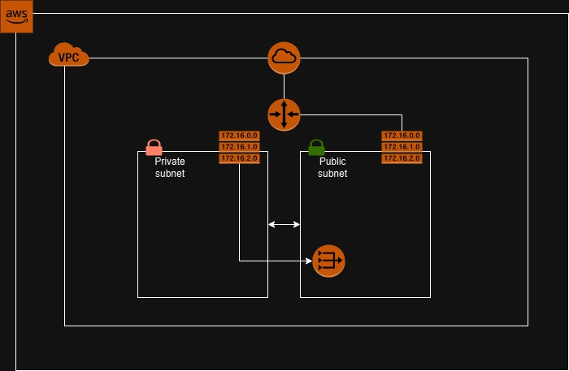

# AWS Network Infrastructure with Terraform

## Objective

This project uses Terraform to provision a basic network infrastructure on AWS in three environments (prod, staging and dev).  

It includes the creation of:
- VPC
- subnet
- internet gateway
- nat gateway
- route tables
- elastic ip

The goal is to practice Infrastructure as Code (IaC) by managing AWS resources using Terraform.

## Technical description

### Diagram



### Folder structure

```
├── modules/
│   │
│   ├── resource_a/
│   │   ├── main.tf
│   │   ├── variables.tf
│   │   └── outputs.tf
│   │
│   ├── resource_b/
│   │   ├── main.tf
│   │   ├── variables.tf
│   │   └── outputs.tf 
│   │
│   └── ...
│
├── main.tf
├── provider.tf
├── variables.tf
└── terraform.tfvars
```

**Description:**

- **modules/**: Contains reusable Terraform modules that encapsulate specific infrastructure components (e.g., networking, compute, storage).

- **main.tf**: The main entry point for the Terraform configuration.

- **provider.tf**: File that defines the communication with cloud provider.

- **variables.tf**: File that defines global variables used across all environments.

- **terraform.tfvars**: File with declaration of global variables used across all environments.
